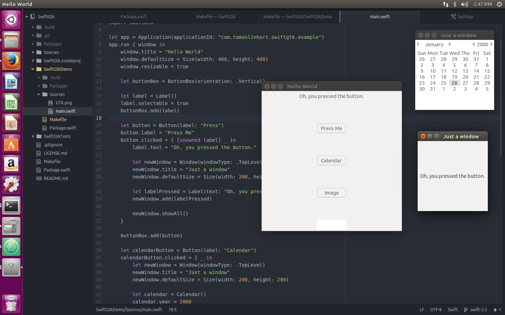

# SwiftGtk

SwiftGtk is a experimental Gtk+ binding for Swift that tries to make usage of Gtk+ pleasant and "Swifty" as much as possible. Currently it implements only a small subset of Gtk+ and it works on Mac OS X and Linux.

## Dependencies

You need to have Swift 2.2 or higher installed on your computer (tested with build from 25.01.2016) and depending on your platform you need to install Gtk+3. On Mac OS X you also build the project with Xcode.

### Mac OS X

You need to have Gtk+3 installed on your machine. Recommended way for installing Gtk+3 is through [homebrew](http://brew.sh/).

```bash
brew install gtk+3
```

### Linux

You need to have Gtk+3 and Clang installed on your machine. You can easily install them with `apt-get`.

```bash
sudo apt-get install libgtk-3-dev clang
```

## Usage

SwiftGtk supports [Swift Package Manager](https://github.com/apple/swift-package-manager) so you only need to add SwiftGtk to your `Package.swift`.

```swift
import PackageDescription

let package = Package(
    dependencies: [
        .Package(url: "https://github.com/TomasLinhart/SwiftGtk", majorVersion: 0, minor: 1)
    ]
)
```

Whenever you build you need to include headers for CGtk. Check [Makefile](Makefile) how it is done and copy the makefile into your project so you can easily reference all your headers. In case you use other platform than Ubuntu 15.10 or Mac OS X with homebrew you might need to change the paths.

## Demo

Following code will create a window with a button that when it is pressed presents another window.

```swift
let app = Application(applicationId: "com.example.application")
app.run { window in
    window.title = "Hello World"
    window.defaultSize = Size(width: 400, height: 400)
    window.resizable = true

    let button = Button(label: "Press Me")
    button.clicked = { _ in
        let newWindow = Window(windowType: .TopLevel)
        newWindow.title = "Just a window"
        newWindow.defaultSize = Size(width: 200, height: 200)
        let labelPressed = Label(text: "Oh, you pressed the button.")
        newWindow.add(labelPressed)

        newWindow.showAll()
    }

    window.add(button)
}
```



## License

All code is licensed under MIT license.
